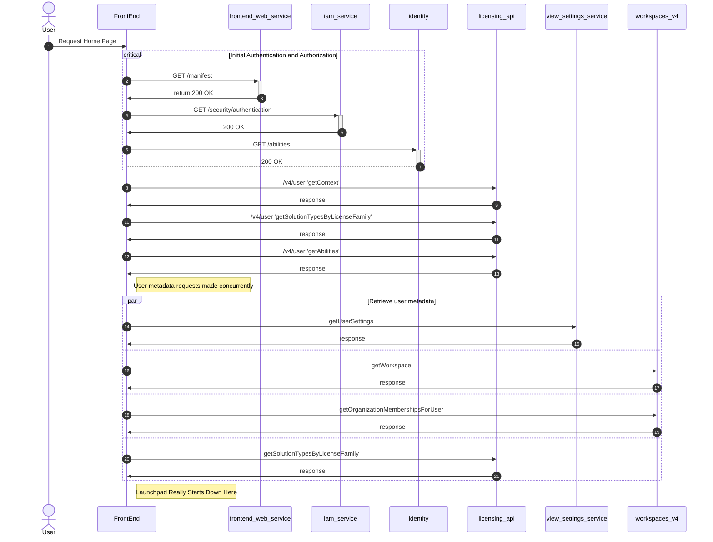

# Sequence Diagram

## Mermaid Notes

- VSCode preview works on .md files only so create a .md w/ embedded mermaid instead of .mmd file
- Mermaid doesn't seem to have grouping for participants

# Launch Pad Sequence

## Questions
- Frugal subscriptions seem to correlate to a back end? Sub#2 is consitently used
for licensing API for example
- How are subcription IDs(?) formed, looks like `workspace + JWT + ???` 
mostly like `QWNjb3VudB8xNTMwODAwMjAw.TWVtYmVyc2hpcB8xNTE0ODYwMzQ4.243159c1-7979-4744-82e0-07a413121133`
but also `QWNjb3VudB8xNTMwODAwMjAw.TWVtYmVyc2hpcB8xNTE0ODYwMzQ4.licensing-service.Events.EventCreated`
and also
`organization_rule.3730edc2-7091-4eaf-ab1c-513f44fabd3f.V0ZVc2VyHzQ2MTIzODIzODA1MjM1MjA.workspaces.OrganizationUser.WorkspaceMembershipRemoved`

ConfigUI team (support-landingpage)
